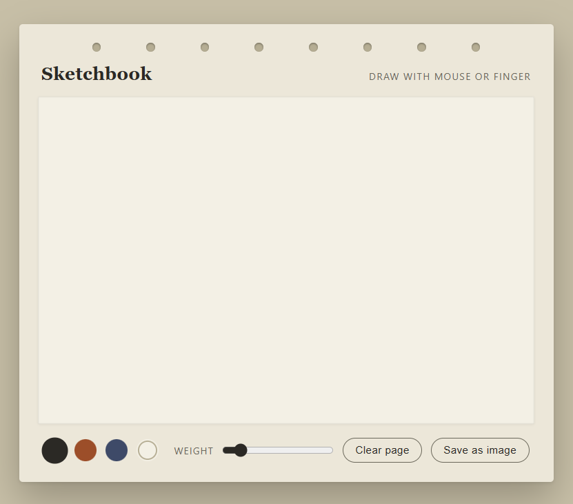
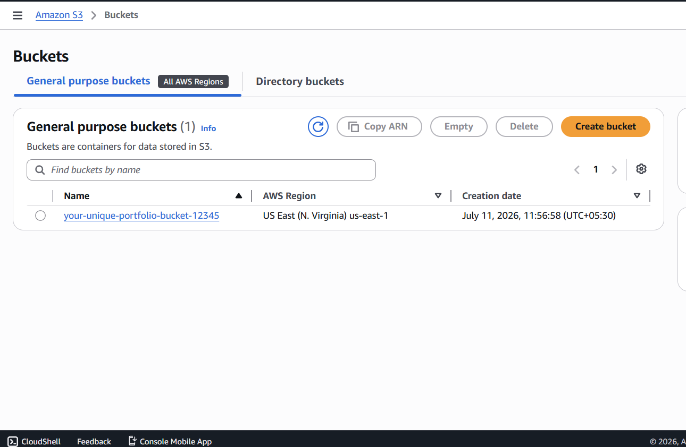
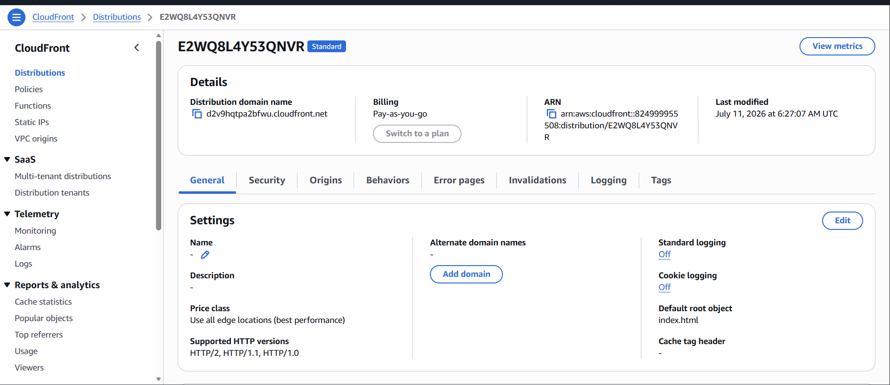

# AWS Sketch Website using Terraform & GitHub Actions

## 📌 Project Overview

This project demonstrates how to deploy a static portfolio website on **AWS** using **Terraform** for Infrastructure as Code (IaC) and **GitHub Actions** for Continuous Deployment (CI/CD).

The infrastructure is automatically provisioned with Terraform, while every code push to the `main` branch triggers a GitHub Actions workflow that deploys the latest website files to Amazon S3.

---

## 🚀 Technologies Used

* AWS S3
* AWS CloudFront
* AWS IAM
* Terraform
* Git
* GitHub
* GitHub Actions
* HTML5
* CSS3
* JavaScript

---

## 📂 Project Structure

```text
aws-static-website/
│
├── .github/
│   └── workflows/
│       └── deploy.yml
│
├── terraform/
│   ├── versions.tf
│   ├── provider.tf
│   ├── variables.tf
│   ├── terraform.tfvars
│   ├── main.tf
│   ├── website.tf
│   ├── cloudfront.tf
│   └── outputs.tf
│
├── website/
│   ├── index.html
│   ├── style.css
│   ├── script.js
│   └── images/
│
├── README.md
└── .gitignore
```

---

## 🏗️ Architecture

```text
                  Developer
                      │
               Write Website Code
                      │
                      ▼
               Local Project Folder
                      │
            terraform apply (One Time)
                      │
                      ▼
          Terraform Creates AWS Resources
                      │
      ┌───────────────┼────────────────┐
      │               │                │
      ▼               ▼                ▼
  S3 Bucket     Website Hosting    Bucket Policy
                      │
                      ▼
             CloudFront Distribution
                      │
                      ▼
             GitHub Repository
                      │
                git push
                      │
                      ▼
              GitHub Actions CI/CD
                      │
                      ▼
          Upload Website Files to S3
                      │
                      ▼
               CloudFront CDN
                      │
                      ▼
                    Users
```

---

## ⚙️ Infrastructure Created

Terraform provisions the following AWS resources:

* Amazon S3 Bucket
* Static Website Hosting
* Public Bucket Policy
* Public Access Configuration
* CloudFront Distribution
* Website Files Upload

---

## 📄 Website Features

* Responsive Design
* Portfolio Home Page
* About Section
* Skills Section
* Projects Section
* Contact Page
* Smooth Scrolling
* Mobile Friendly
* Vanilla HTML, CSS & JavaScript

---

## 🔄 CI/CD Workflow

Whenever changes are pushed to the `main` branch:

1. GitHub Actions starts automatically.
2. AWS credentials are loaded from GitHub Secrets.
3. The workflow synchronizes the `website/` folder with the S3 bucket.
4. Updated files become available through CloudFront.

This enables automatic deployment without manually uploading files.

---

## 🛠️ How to Deploy

### 1. Clone the Repository

```bash
git clone https://github.com/your-username/aws-static-website.git
cd aws-static-website
```

### 2. Configure AWS Credentials

Set up your AWS CLI credentials:

```bash
aws configure
```

Provide:

* AWS Access Key ID
* AWS Secret Access Key
* Region (for example, `us-east-1`)
* Output format (`json`)

---

### 3. Initialize Terraform

```bash
cd terraform
terraform init
```

---

### 4. Review the Execution Plan

```bash
terraform plan
```

---

### 5. Create the Infrastructure

```bash
terraform apply
```

Type:

```text
yes
```

Terraform will create the AWS infrastructure and upload the website files.

---

### 6. Configure GitHub Secrets

Add the following repository secrets:

| Secret                | Description           |
| --------------------- | --------------------- |
| AWS_ACCESS_KEY_ID     | AWS Access Key        |
| AWS_SECRET_ACCESS_KEY | AWS Secret Access Key |
| AWS_REGION            | AWS Region            |
| S3_BUCKET             | Name of the S3 Bucket |

---

### 7. Automatic Deployment

After making changes to the website:

```bash
git add .
git commit -m "Updated website"
git push
```

GitHub Actions automatically deploys the latest files to the S3 bucket.

---

## Website Preview



## Website Preview



## Website Preview



---

## 📷 Future Improvements

* Custom Domain with Amazon Route 53
* HTTPS using AWS Certificate Manager (ACM)
* CloudFront Origin Access Control (OAC)
* Terraform Remote State
* Multi-environment deployment (Dev, QA, Production)
* Monitoring with Amazon CloudWatch
* Infrastructure validation in the CI/CD pipeline

---

## 📚 Key Concepts Demonstrated

* Infrastructure as Code (Terraform)
* AWS Cloud Services
* Static Website Hosting
* Continuous Integration & Continuous Deployment
* Git Version Control
* CloudFront Content Delivery Network
* IAM Authentication
* Automated Deployments

---

## 👨‍💻 Author

**Your Name**

Aspiring AWS & DevOps Engineer

* GitHub: https://github.com/DevPondwal1
* LinkedIn: www.linkedin.com/in/dev-pondwal-b384b1167

---

## 📜 License

This project is provided for learning and portfolio purposes. You are welcome to fork, modify, and use it as a reference for your own AWS and DevOps projects.
